# 图论基础
- 表示图：$ (N,L) $, $N$: node, $L$: links(edges)

- 平均度
无向图：$ \langle k \rangle = \frac{1}{N} \sum_{i=1}^{N}x_i = \frac{2L}{N}$
有向图：$ \langle k \rangle^{in}=\langle k\rangle^{out}=\frac{1}{N}\sum_{i=1}^{N}x_i^{in}=\frac{1}{N}\sum_{i=1}^{N}x_i^{out}$
$\langle k\rangle=\frac{L}{N}$

- 度分布(degree distribution)
$P(k)$: probability that a randomly chosen node has degree k
$N_k$ = # nodes with degree k
$P(k)=N_k/N$

- 邻接矩阵**(adjacency matrix)
$A_{i,j}=1$ if there is a link between node i and j
$A_{i,j}=0$ if nodes i and j are not connected to each other.
无向图的邻接矩阵对称，每条边对应2个1
$ L=\frac{1}{2} \sum_{i=1}^N k_i=\frac{1}{2} \sum_{i,j}^N A_{i,j} $
有向图的邻接矩阵不对称，每条边对应1个1
$ L=\sum_{i=1}^N k_i^{in}=\sum_{i=1}^N k_i^{out}=\sum_{i,j}^N A_{i,j} $
点多了就不方便

- 只存边，只需要大小为$L*2$的矩阵

**完全图**(Complete Gragh)
$L_{max}=\binom{N}{2}=\frac{N*(N-1)}{2}$
average $\langle k\rangle=N-1$

Most networks observed in real systems are sparse
大部分实际中的图都是稀疏的

Metcalfe’s Law: the Value of a networks
一个网络的价值与节点数的平方成正比

考虑权重：
邻接矩阵仍然适用（把1改成权重）
或只存边，只需要大小为$L*3$的矩阵

**二分图**(Bipartite graph)

定义：一个图的节点可以分为两个集合U和V，每条边分别连接两个集合中的一个节点
映射：
Projection U：如果U中两个点共同连接一个V中的点，则把这两个点相连
Projection V：如果V中两个点共同连接一个U中的点，则把这两个点相连
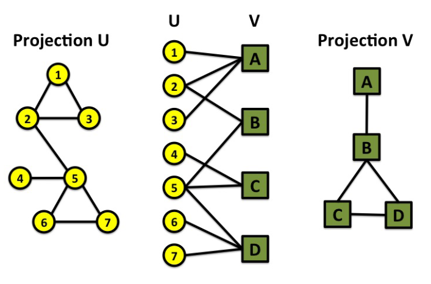{:height="80%" width="80%"}

**路径** (Paths)
$P_n=\{ i_0,i_1,...,i_n\}$ or $P_n=\{ (i_0,i_1),(i_1,i_2),...,(i_{n-1},i_n)\}$
有向图要依照箭头方向
$N_{ij}$ (路径数量):
length 2: $N_{ij}^{(2)}=\sum_{k=1}^N A_{ik}A_{kj}=[A^2]_{ij}$
length n: $N_{ij}^{(n)}=[A^n]_{ij}$

**直径** (Diameter): 最大的Distance
平均距离($L_{max}$是完全图边数): 
$\langle d \rangle = \dfrac{1}{2L_{max}} \sum_{i,j!=i} d_{ij}$ (有向图) 
$\langle d \rangle = \dfrac{1}{L_{max}} \sum_{i,j>i} d_{ij}$ (无向图)

**连通图**：任何两个点都有路径相连
连通块可以从邻接矩阵中看出（没有相连）

**聚类系数**(Clustering coefficient)：邻居节点连边数/可以连边数
$C_i=\dfrac{2L_i}{k_i(k_i-1)}, C_i \in [0,1]$
$\langle C \rangle = \frac{1}{N} \sum_{i=1}^N C_i$ 
$L_i$ 是neighbors之间的连边数

# 随机网络(random network)
G(N, p): 随机网络有N个节点，每两个节点之间连边的概率为p\
P(L): 随机网络中恰好有L条边的概率
P(L)其实是二项分布
$P(L)=\dbinom{\binom{N}{2}}{L} p^L (1-p)^{\frac{N(N-1)}{2}-L}$
$\langle L \rangle=\sum_{L=0}^{\frac{N(N-1)}{2}} Lp_L=p\frac{N(N-1)}{2}$
$\sigma^2=p(1-p)\frac{N(N-1)}{2}$
ER网络是一种经典的随机网络

**度分布（随机网络）**(degree distribution)：
$P(k)=\dbinom{N-1}{k}p^k(1-p)^{(N-1)-k}$
$\langle k \rangle=p(N-1)$
$\sigma_k^2=p(1-p)(N-1)$
$\dfrac{\sigma_k}{\langle k \rangle}\approx\dfrac{1}{(N-1)^{1/2}}$
当图的规模很大时，分布集中在$\langle k \rangle$附近
N远大于k，接近泊松分布，即：
$P(k)=e^{-\langle k \rangle}\dfrac{\langle k \rangle^k}{k!}$(poisson distribution)

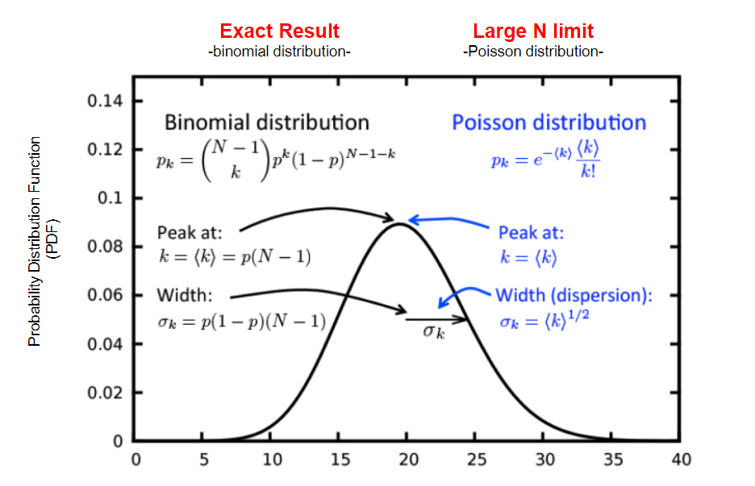{:height="80%" width="80%"}

**真实网络并非Poisson分布**

**随机网络的演化**(Evolution):
$N_G$: 最大连通块（giant component） 
$S=N_G/N$: 在最大连通块中的点的比例
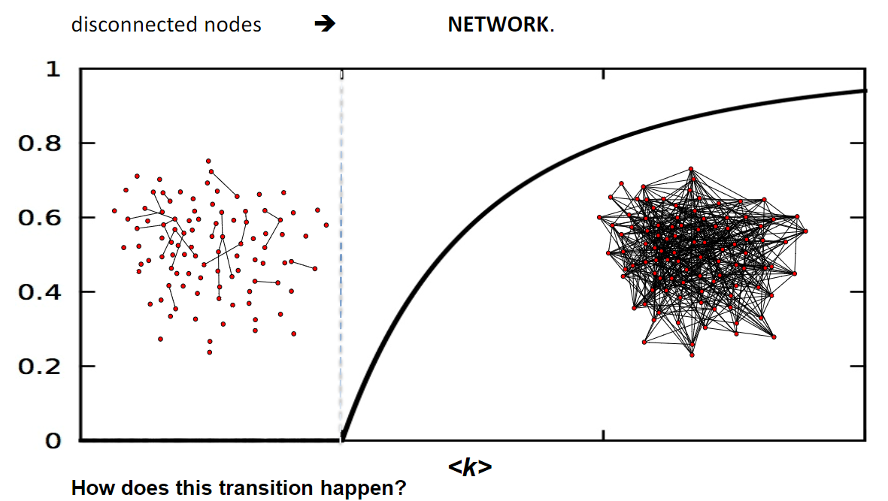{:height="80%" width="80%"}
$\langle k_c \rangle=1$时， $S$发生突变，开始产生大型连通集
（要形成大型连通集，需要每个点连一条边）
此时$p_c=\frac{1}{N-1}\approx \frac{1}{N}$
(critical point)
所以对于大型图，p很小也可以形成大型连通集

$S=1-e^{-\langle k \rangle S}$

**聚类分布**
$P(s)$: 一个点在一个大小为s的聚类(cluster)中的概率
$P(s)\sim s^{-3/2}e^{-(\langle k \rangle-1)s+(s-1)ln\langle k \rangle}$
At critical point $\langle k \rangle=1, P(s)\sim s^{-3/2}$

Subcritical: 没有GC,最大cluster是树，
$\langle k \rangle<1$, $p<p_c=1/N$
$P(s)\sim s^{-3/2}e^{-(\langle k \rangle-1)s+(s-1)ln\langle k \rangle}$
Critical: 小的连通块是树，GC有环
$\langle k \rangle=1$, $p=p_c=1/N$
$N_G\sim N^{2/3}$
$P(s)\sim s^{-3/2}$
Supercritical: GC有环
$\langle k \rangle>1$, $p>p_c=1/N$
$N_G\sim (p-p_c)N$
$P(s)\sim s^{-3/2}e^{-(\langle k \rangle-1)s+(s-1)ln\langle k \rangle}$
Connected: 全部连通，只有一个cluster
$\langle k \rangle>ln N$, $p>ln N/N$

**真实网络是supercritical**

### 小世界模型（Small-World Model）

- **六度分离理论**: Everybody on this planet is separated by only six other people
- 聚类系数高，路径长度短
- 近似Poisson分布
- 典型：社交网络、神经网络

Random Network 平均距离 $\langle d \rangle \sim log N$
$\langle d \rangle = \dfrac{log N}{log \langle k \rangle}$

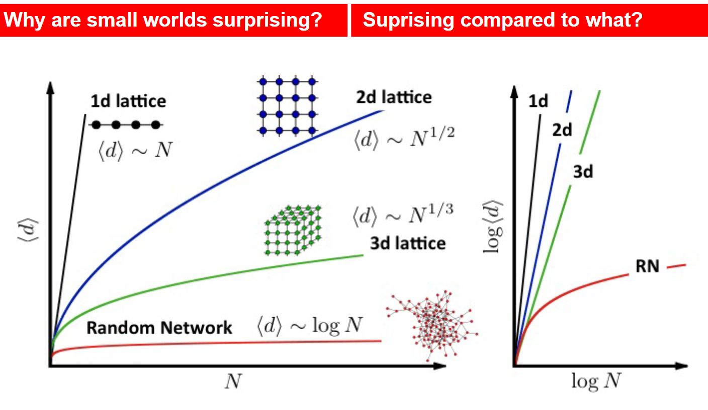{:height="80%" width="80%"}

**聚类系数**
$\langle L_i\rangle = p\frac{k_i(k_i-1)}{2} \Rightarrow C_i=\dfrac{2\langle L_i \rangle}{k_i(k_i-1)}=p=\dfrac{\langle k \rangle}{N}$
C随N的变小而变小
C与一个点的度k独立

在随机网络中，已知$N$和$\langle k \rangle$，可以知道平均路径长度，聚类系数，度分布

**真实网络并非随机**
以上三个只有平均路径长度比较符合

# Scale-Free Property

- `World Wide Web(WWW)`
- `Barabási-Albert Model(BA)`
- 幂律分布
  - 有一些度非常大的点
- 无标度网络（Scale-Free Network）
  - 符合 `Power Law` 的度分布
  - `Power Law`: $p_k \sim k^{-\gamma}$
  - 例子：世界上的财富分布。少数人占有大部分财富。
- 枢纽(`Hubs`)
  - 幂律分布中`k`较大的分布比泊松分布多，允许存在`Hubs`
  - 例子：铁路网类似泊松分布（度都差不多），航线图类似幂律分布（大城市机场的度非常大）
  - Power-Law: $k_{max}=k_{min}N^\frac{1}{\gamma -1}$
    - $\gamma > 2$: $k_{max}$ 增长比N慢 很多实际网络的$\gamma$在`2`到`3`之间
    - $\gamma = 2$: $k_{max}\sim N$ 最大hub的大小为O(N)
    - $\gamma < 2$: $k_{max}$ 增长比N快 
    - 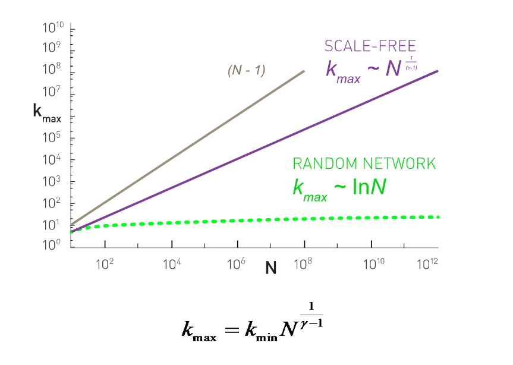{:height="80%" width="80%"}
- 无标度的含义
  - 尺度不变性（Scale invariance）：截取小块，分布与整体相似
  - 普遍性（universality）：现实中很多系统都服从幂律分布
  - 发散性（divergence）: 
    - $\langle k^m \rangle = \int_{k_{min}}^{\infty}k^m P(k) dk$
    - if $m-\gamma +1<0, \langle k^m \rangle = -\dfrac{(\gamma-1)}{(m-\gamma+1)}k_{min}^m$
    - if $m-\gamma+1>0$, the integral diverge
  - $k=\langle k \rangle \pm \sigma_k$
  - Ultra-small property
    - 平均距离
      - 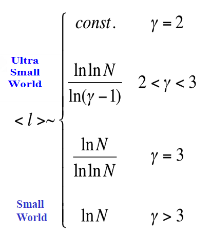{:height="50%" width="50%"}
      - 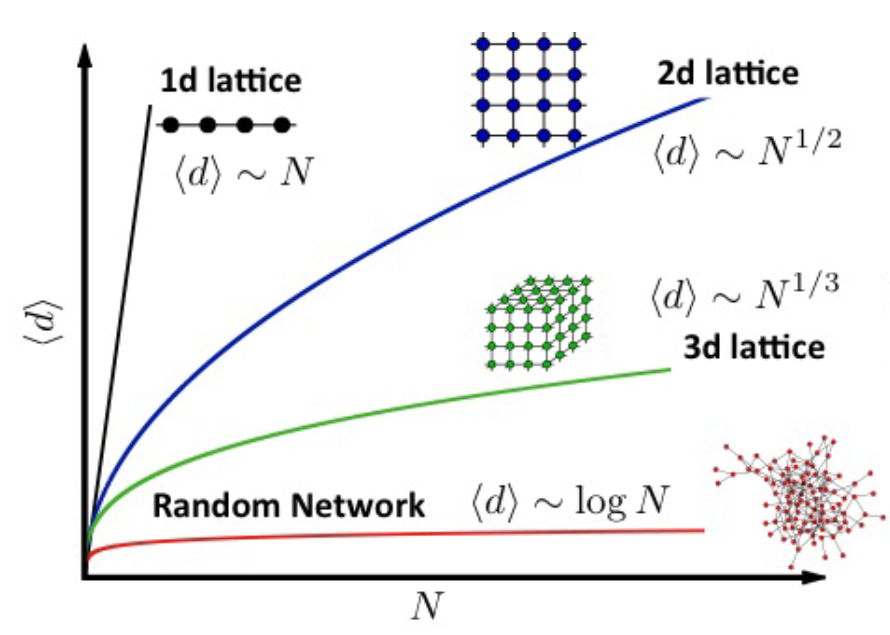{:height="80%" width="80%"}
- Summary
  - 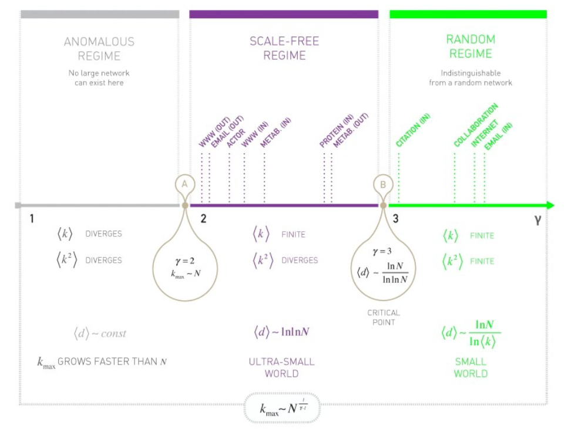
- 度分配模型
# Barabási-Albert Model
- ER和WWW网络对比
  - ER：节点数N确定，随机加边，是Poisson分布
  - WWW：依靠添加节点，偏好连接hubs（枢纽点），是Scale-Free分布
- BA Model
  - 也是一种Scale-Free Model
  - Growth: 每次添加一个有m个连接的点
  - Preferencial Attachment: 一个点连接一个有k个连接的点的概率和k成正比（偏好连接多的点） $\Pi(k_i) = \frac{k_i}{\sum_j k_j}$
  - Linearized Chord Diagram
- Degree Dynamic
  - 节点连接增加的速度（由于别的节点连接它）$\frac{dk_i}{dt} = m\Pi(k_i) = m\frac{k_i}{\sum_{j=1}^{N-1}k_j} = m\frac{k_i}{2mt-m} = \frac{k_i}{2t-1}$，其中m指每个新节点连m条边
  - 当`t`很大时，$\frac{dk_i}{k_i} = \frac{1}{2} \frac{dt}{t}$
  - 设$k_i(t_i)=m$(node i在$t_i$时刻加入，连边量为m)。积分可以得到$k_i(t) = m(\frac{t}{t_i})^\beta$ 
  - $\beta = \frac{1}{2}$ is the dynamical exponent
  - BA Model: $k(t) \sim t^{1/2}$
  - $\frac{dk_i(t)}{dt} = \frac{m}{2} \frac{1}{\sqrt{t_i t}}$
  - 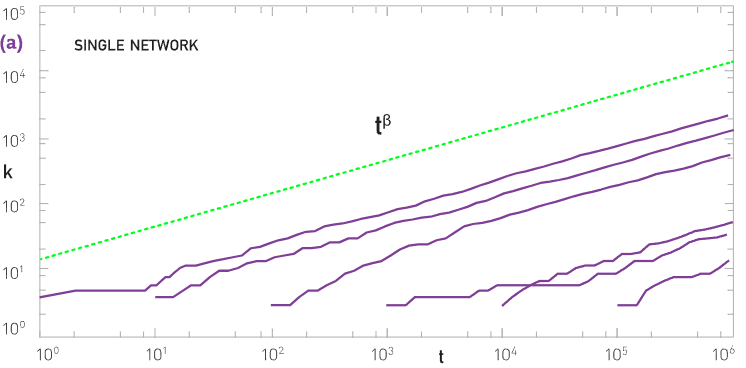
- 度分布(Degree distribution)
  - $P(k) = \frac{2m^2t}{m_0+t} \frac{1}{k^3} \sim k^{-\gamma}$
  - $P(k) = \frac{2m(m+1)}{k(k+1)(k+2)}$ 使用Rate equation based approach 
  - $P(k) \sim k^{-3}$ for large k
- 一些BA Model的变化
  - 若不遵循preferential attachment，直接连(uniform)，有growth
    - $\Pi(k_i) = \frac{1}{m_0+t-1}$
    - $P(k) = \frac{e}{m} \exp(-\frac{k}{m}) \sim e^{-k}$
    - 得不到幂律分布
  - 若没有growth，只有preferential attachment，每次从已有点中选择点来往外连
    - 修正：假设度为0的节点初始概率为1/n
    - $p_k$: power law(initially) $\rightarrow$ Gaussian $\rightarrow$ Fully Connected
    - 得不到幂律分布
  - 我们同时需要growth和preferential attachment
- 测量Preferencial Attachment
  - 验证：看度的增加量($\frac{\Delta k_i}{\Delta t}$)和度($k_i$)是否成正比
  - $\frac{\partial k_i}{\partial t} \propto \Pi(k_i) \sim \frac{\Delta k_i}{\Delta t}$
  - $\pi (k) = \sum_{k_i=0}^k \Pi(k_i)$
  - No pref. attach: $\pi \sim k$
  - Linear pref. attach(比如$\Pi(k_i) = k_i$): $\pi \sim k^2$
- Nonlinear pref. attachment
  - $\Pi(k) \sim k^{\alpha}$
    - $\alpha = 0:$ The simple exponential function
    - $\alpha = 1:$ BA Model, scale-free network
    - $0<\alpha <1:$ Sublinear preferential attachment $k_{max} \sim (\ln t)^{1/(1-\alpha)}$
    - $\alpha > 1:$ Superlinear preferential attachment $k_{max} \sim t$
  - $\alpha$ 大的时候，更加偏向度大的点
  - 
- Pref. attachment 的起源
  - 有没有不需要pref. attachment的幂律分布？
    - links selection model
      - 1. growth
      - 2. 每次随机选一条边，选择边的一个端点与新点相连（度大的点还是容易被选中）
    - copying model
      - 1. growth
      - 2. Random Connection: 新的点连接u的概率为p
      - 3. Copying: 随机找一个节点，看它连了什么节点，就去连接什么节点
      - $\Pi (k) = p/N + (1-p)k/(2L)$
      - 例子：社交媒体、引用文献
- Diameter and clustering coefficient
  - $D \sim \frac{\log N}{\log\log N}$
  - $\langle C \rangle \sim \frac{(\ln N)^2}{N}$

# Evolving Networks
## Bianconi-Barabasi Model(Fitness Model)
- 在BA的基础上增加参数fitness
- fitness ($\eta$)：参数越大，吸引边的能力越强
- Definition
  - Growth: 新点j进到系统时，赋值fitness $f_j$, fitness不随着时间变化。
  - Preference: $\Pi_i = \dfrac{\eta_i k_i}{\sum_j \eta_j k_j}$
- BA model: $k(t) \sim t^{1/2}$ 先进的有优势
- $k(\eta, t) \sim t^{\beta(\eta)}$ fit大的有优势 $0<\beta(\eta)<1$
- 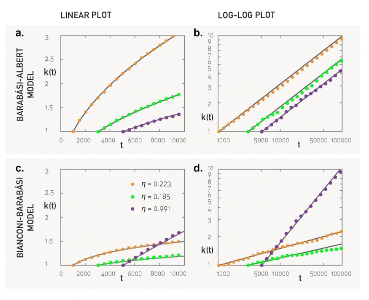{ :height="70%" width="70%"}
- Analytical
  - $\dfrac{\partial k_i}{\partial t} = m \dfrac{\eta_i k_i}{\sum_j \eta_j k_j}$
  - $C = \int d\eta \rho(\eta) \frac{\eta}{1-\beta(\eta)}$
  - $\beta(\eta) = \frac{\eta}{C}$ C是由fitness确定的一个值
  - degree distribution: $p_k \approx C \int \frac{\rho(\eta)}{\eta} (\frac{m}{k})^{\frac{C}{\eta}+1} d\eta$
- Measuring Fitness
  - $k(t,t_i,\eta_i) = m (\dfrac{t}{t_i})^{\beta(\eta_i)}$ ,  $\beta(\eta) = \dfrac{\eta}{C}$
  - 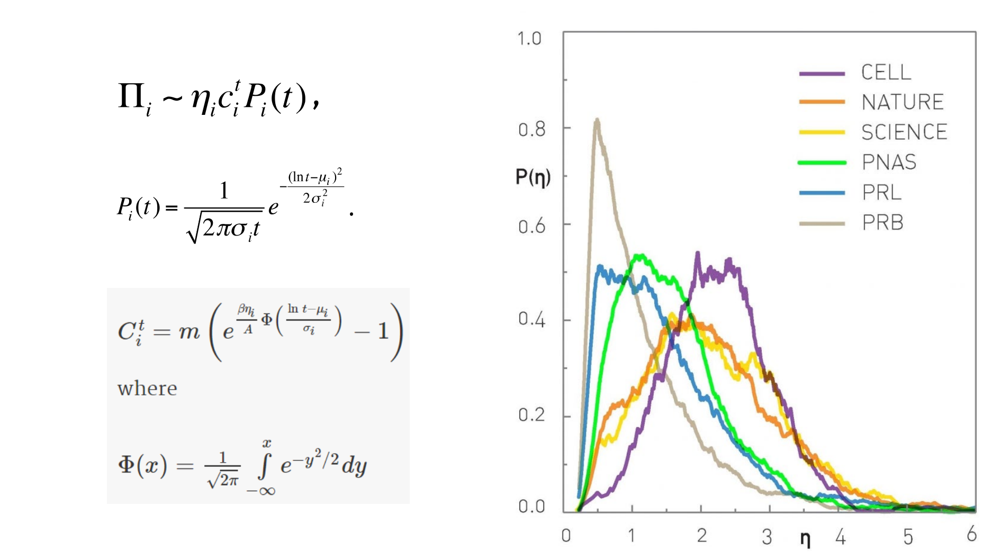
  - 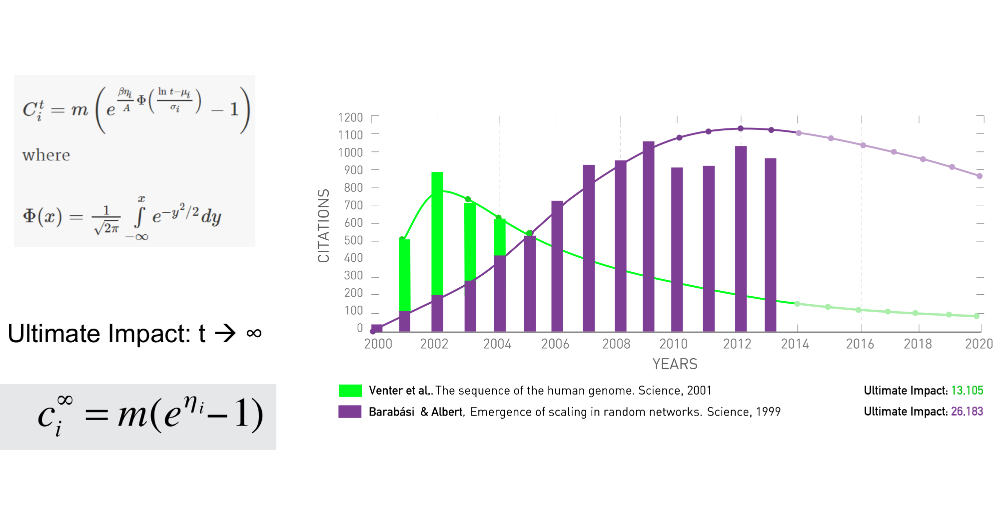

## Evolving Networks
- BA 模型的缺陷
- Initial Attractiveness
  - $\Pi(k) \sim A + k$ 这里 A: initial attractiveness
  - $\gamma = 3 + \frac{A}{m}$ degree exponent增加
  - $p_k = C(k+A)^{-\gamma}$ small-degree satuation 
- Internal Links
  - $\Pi(k,k')\sim(A + Bk)(A'+B'k')$
  - $\gamma = 2 + \frac{m}{m+2n}$ Doule preferential attachment(A=A'=0)
  - $\gamma = 3 + \frac{2n}{m}$ Random attachment(B=B'=0)
- Node Detection
  - Start with BA Model
  - In each time step
    - add a new node with m links
    - with rate r remove a node
- Accelerated growth
  - $m(t) = m_0t^\theta$
- Aging
  - $\Pi(k,t-t_i)\sim k(t-t_i)^{-v}$
  - v<0: enhance preferential attachment
  - v>0: new nodes attach to younger nodes

midterm: 1-7, 9 无cp, 不会有特别复杂的内容

# Community(社团)
- 高内聚性，低耦合性
- clique: k个节点的完全联通集
  - triangle很多，大型的clique很少
- Strong and Weak communities
  - 子图$C$有$N_C$个节点
  - Internal degree($k_i^{int}$): i点连到内部的边数
  - External degree($k_i^{ext}$): i点连到外部的边数
  - $k_i^{ext}=0$: C是good community for i
  - $k_i^{ext}=0$: i应该属于别的community
  - Strong community: 所有C中的点都是int>ext $k_i^{int}(C)>k_i^{ext}(C)$
  - Weak community: C中int总和大于ext $\sum_{i in C} k_i^{int}(C) > \sum_{i in C} k_i^{ext}(C)$
- 把一个网络分为2个community，分法：$\dfrac{N!}{n_1!n_2!}$
  - 很大，不能一一枚举
- Bell Number: 把N个节点分到community的种类
  - $B_N = \frac{1}{e}\sum_{j=0}^{\infty}\frac{j^N}{j!}$
## Hierarchical Clustering(层次聚类)
  - 相似度矩阵（similarity matrix）表示节点之间的距离
  - agglomerative algorithms：把相似度高的节点放到同一个community中（merge）
    - Ravasz algorithm
    - Step1: Define the Similarity Matrix 共同邻居多的节点倾向于在同一个community，相似度更大
    - Step2: Decide Group Similarity 确定community之间的similarity，可以采用single，complete or average，这里采用平均
    - Step3: Apply Hierarchical Clustering 合并相似度较高的节点成为community，再合并相似度最高的community，重复直到所有节点成为一个community
    - Step4: Build Dendrogram 绘制树状图，包含各节点合并入的时间顺序
  - divisive algorithms：切分community，移除相似度较小的节点（split）
    - Girvan-Newman algorithm
    - Step1: Define a Centrality Measure 
      - Link betweenness（边介数）是一条边在最短路中出现的概率
      - Random-walk betweenness（随机游走介数）通过模拟随机游走过程，统计节点或边在所有可能路径中被经过的频率
    - Step2: Hierarchical Clustering 每次去除最重要的边（centrality 大），并生成dendrogram
    - 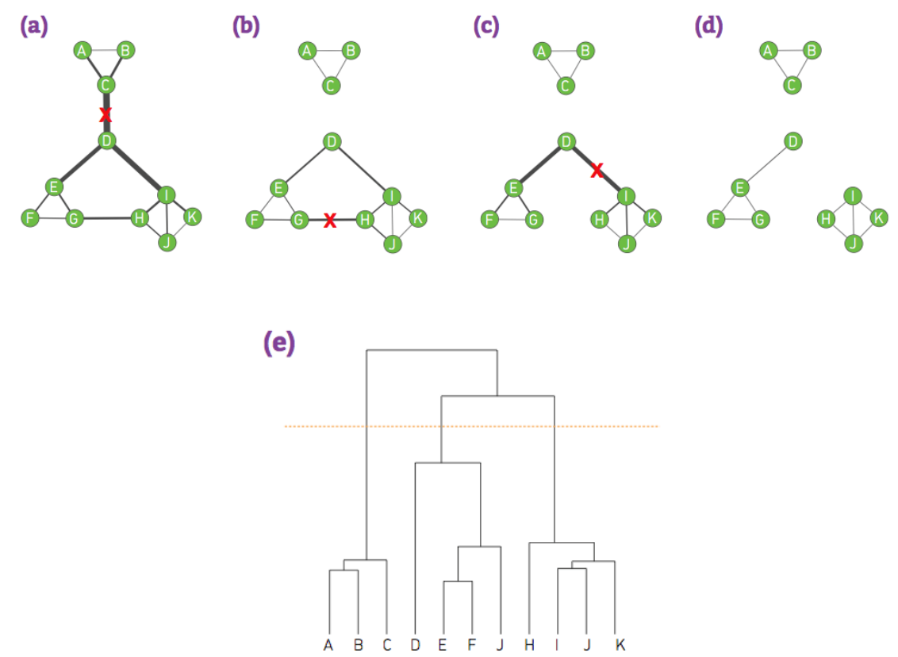
  - Hierarchical tree：可视化merge和split的步骤
## Modularity
  - 随机连成的网络通常不具有community结构
  - 量化了网络中​​社区内部连接的紧密程度​​相对于随机网络的差异，值越高说明社区划分越合理
  - 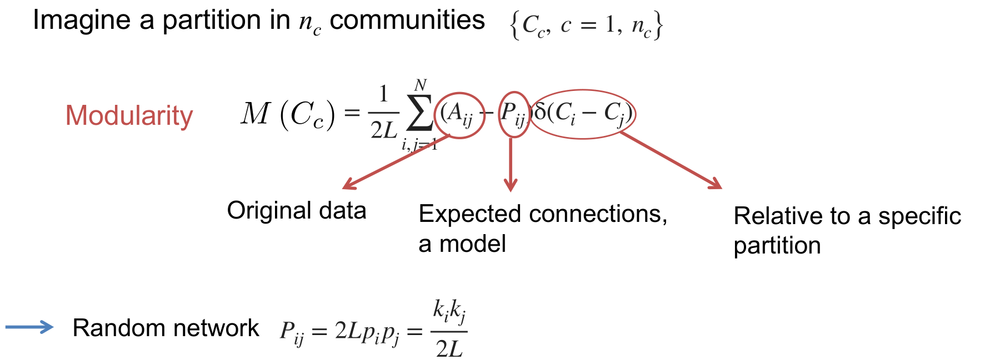
  - 目标​​：评估社区划分是否显著优于随机连接（即社区内部连接是否比随机预期更密集）。
  - 另一种表示 $M(C_c) = \sum_{c=1}^{n_c} [\frac{l_c}{L} - (\frac{k_c}{2L})^2]$
  - 贪心算法：如果一个变动使modularity增加，采用这个变动
  - Modularity has a resolution limit

## Overlapping Communities
- Clique Percolation
- 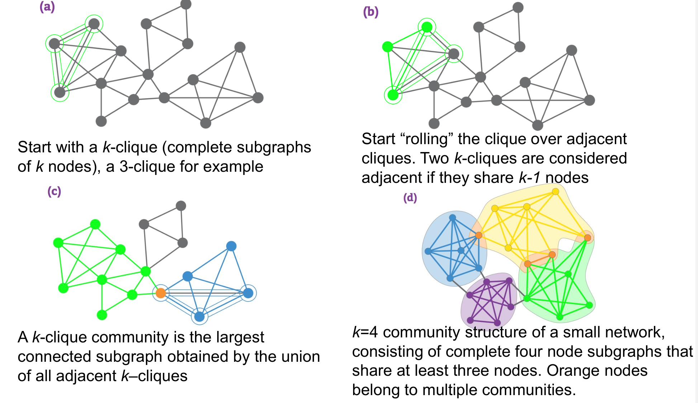
- A k-clique community emerges in a random graph only if the connection probability exceeds the threshold:
- 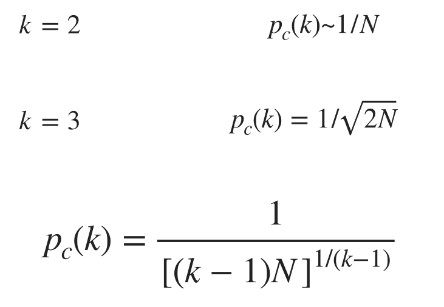
- k-clique只出现在足够dense的network中

## Testing Community
- Newman-Girvan(NG) Benchmark
  - Control parameter $\mu = \dfrac{k^{ext}}{k^{ext}+k^{int}}$
  - 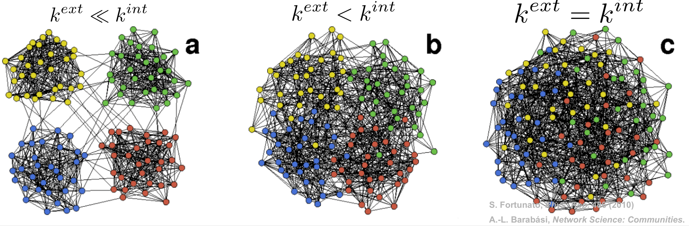
- Lancichinetti-Fortunato-Radicchi (LFR) Benchmark
  - 服从幂律分布（社区数，度分布）
  - N个点分为$N_c$个community，有$P_{N_c}\sim N_C^{-\xi}$
  - 每个节点的度分布有$P_k \sim k^{-\gamma}$
  - 每个节点 i 被分配到community内，有入度$(1-\mu)k_i$，出度$\mu k_i$
  - 连接这些节点
  - 
- Measuring Accuracy
  - 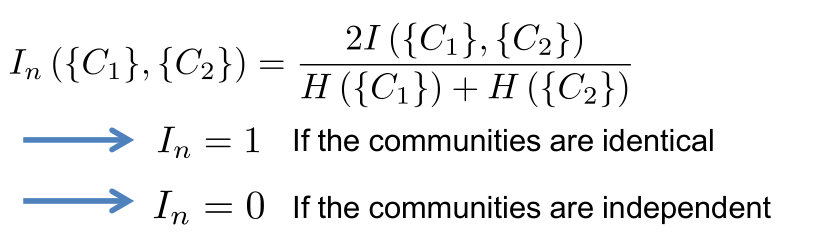

# Degree Correlation(度相关性)
- hubs往往会与其他hubs有联系（名人与名人之间）
- $p_{kk'} = \frac{kk'}{2L}$ 一个度为k和一个度为k'节点连边的概率
- 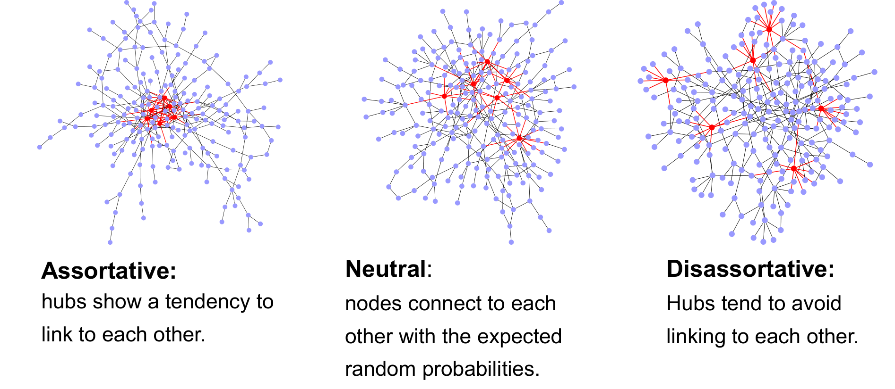
- degree correlation matrix: $e_{ij}$表示度为i和j的两个节点连边的概率
- statistical description
  - $\sum_{j,k}e_{jk} = 1$ 
  - $\sum_{j}e_{jk} = q_k$
  - $q_k$：有一端度为k的概率
  - $q_k = \frac{kp_k}{\langle k \rangle}$
  - $e_{jk} = q_j q_k$ If the network has no degree correlations
- Perfect Assortativity: 所有点只连接度和自己相同的，$e_{jk} = \xi_{jk}q_k$
## Measuring Degree Correlation
- $k_{nn}(k)$: 一个度为k的点的邻居的平均度
- $k_{nn}(k) = \sum_{k'}k'P(k'|k)$
- following a link of a k-degree node we reach a degree-k' node
- $k_{nn}(k) = ak^\mu$
  - Neutral Network($\mu = 0$): 
    - $P(k'|k) = \dfrac{e_{kk'}}{\sum_{k'}e_{kk'}} = q_k$
    - $k_{nn}(k) = \frac{\langle k^2 \rangle}{\langle k \rangle}$
  - Assortative Network($\mu > 0$):
    - $k_{nn}(k)$ increase with k
  - Disassortative Network($\mu < 0$):
    - $k_{nn}(k)$ decrease with k
- $\langle k_{nn}(k)k \rangle = \langle k^2 \rangle (k_{max}-1)$ independent elements
- $r = \dfrac{\sum_{jk}jk(e_{jk}-q_jq_k)}{\sigma_r^2} (-1<=r<=1)$
  - $r<=0$ disassortative: hubs tend to link small nodes
  - $r=0$ neutral
  - $r>=0$ assortative: hubs tend to link other hubs
  - $\mu$和$r$的正负性是一致的
## Structual cutoffs
- 一种现象
- $E_{kk'} = e_{kk'}\langle k \rangle N$ Number of edges between the set of nodes with degree k and degree k’
- $m_{kk'} = min(kN_k, k'N_{k'}, N_kN_k')$ Maximum number of edges between the two groups
- $r_{kk'} = \frac{E_{kk'}}{m_{kk'}} < 1$
- in neutral network
  - $k_s(N) = (\langle k \rangle N)^{1/2}$
  - 节点的度不能大于这个值，否则没有足够的边来维持neutral nature of the network
- in scale-free network
  - $k_{max} = k_{min} N^{\frac{1}{\gamma - 1}}$